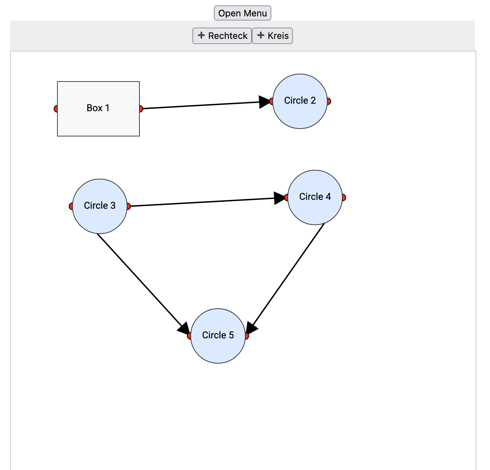

# Basic code kata

minimal functional component to draw a rectangle and a circle
with a given width and height. Create connectors to draw a line
between the two shapes. Drag the shapes around the screen.

