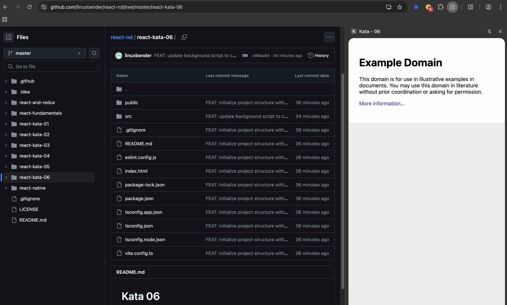

# Kata 06

In this kata, you will learn how to develop a simple sidebar extension for Chrome or Edge.  
We use React and TypeScript to create the sidebar. The sidebar loads a React component that displays the website example.com.  
For this, we use a simple iframe to show the website inside the sidebar.

## Installation

To install the dependencies for this kata, run the following command in your terminal:

```bash
npm install && npm run build
```

## Running the extension

To run the extension, you need to load it into your browser. Follow these steps:

1. Open Chrome or Edge and go to `chrome://extensions/` or `edge://extensions/`.
2. Enable "Developer mode" by toggling the switch in the top right corner.
3. Click on "Load unpacked" and select the `dist` folder of this kata.
4. The extension should now be loaded and you should see the sidebar icon in the toolbar.
5. Click on the sidebar icon to open the sidebar.

## Sidebar Image
