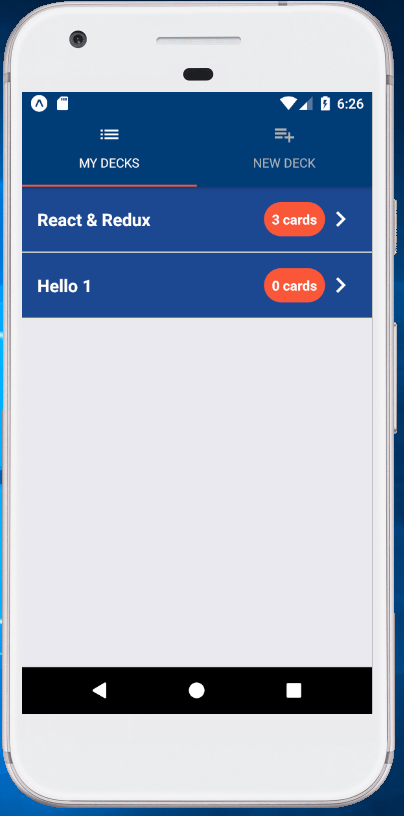

# Mobile Flashcard App

> **INFO**: This is only a Android Version

### App Description
Mobile Flashcards it's an app that lets you create learning flashcards. This app use the native notification service for remind you to learn :-P
Happy Learning

## Prerequisites/Requirements
- Android Studio with an active and running emulator phone setup
- nodejs  with yarn installed
- Expo / React-Native

## Installtion

> **INFO**: First, start Android Studio, open the Android Virtual Device Manager (ADV), select/create a phone emulator and start it.

```
yarn install
yarn android
```

## App Demo Screen's





